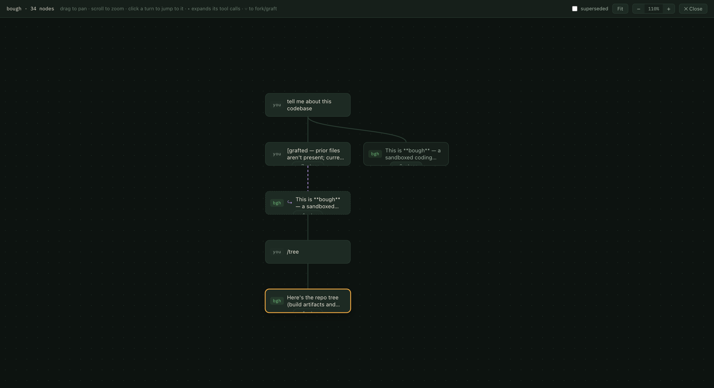
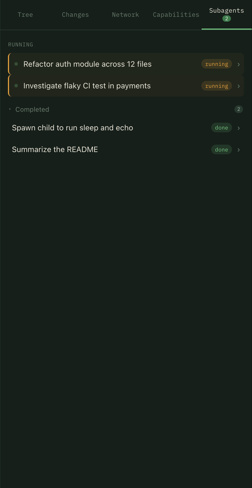

<p align="center">
  
</p>

<h1 align="center">bough</h1>

<p align="center">
  <b>A sandboxed coding agent with branchable history.</b><br>
  <i>A tree you tend in the dark — fork any point, and the filesystem forks with it.</i>
</p>

<p align="center">
  
</p>

bough runs a frontier model as a **supervisor** that plans by writing Python, which a deterministic harness executes inside a **kernel-enforced sandbox** — a [monty](https://github.com/pydantic/monty) Python interpreter plus a **macOS Seatbelt** profile and a per-session [mitmproxy](https://mitmproxy.org) (workspace-only filesystem, default-deny network, secrets blocked). Every turn is a node in a tree you can **fork** — restoring the conversation *and* the files. Written in **Gleam** (BEAM/OTP), served as a headless server with a no-build web UI.

## Why bough

- 🌳 **Branchable history, branchable files.** History is a tree. Fork any earlier turn and the workspace reverts with it — explore a risky change, jump back if it goes wrong.
- 🔒 **Safe to leave running.** Every command runs under a kernel sandbox: workspace-only writes, symlink-safe, `~/.ssh`/`~/.aws` and other secrets denied, network default-deny with a live allow/deny leash.
- 🐍 **Code-mode.** The supervisor writes a small Python program each turn (`bash`/`read`/`write`/`edit`) instead of one-shot tool calls — loops, composition, real control flow.
- ✅ **Deterministic done.** A turn is only "done" when a `CHECK` command exits 0 *and* an adversarial review passes — not when the model says so.

## Install

One line on a Mac — installs the toolchain (Gleam/Erlang, `mitmproxy` for the egress sandbox, `llama.cpp` + the local worker model), clones bough, and builds it:

```bash
curl -fsSL https://raw.githubusercontent.com/andreylukin/bough/main/install.sh | bash
```

Then set a key and go:

```bash
export ANTHROPIC_API_KEY=sk-ant-...    # or OPENROUTER_API_KEY + BOUGH_PROVIDER=openrouter
bough                                   # starts the server and opens http://127.0.0.1:4096
```

`bough update` pulls and rebuilds in place. The installer is idempotent.

## Use it

Point bough at a project and ask. A frontier model plans, the sandbox runs the work, and a deterministic `CHECK` decides when it's done — every turn snapshotted so you can fork the history and the files together.

> Drop an **`AGENTS.md`** at the project root to set build/test commands, conventions, and what "done" means — the supervisor treats it as authoritative.

**Branch anything.** The session map lays out your conversation as a tree with one main trunk; fork from any turn — or any individual tool call — and the files come along. Jump to a turn, expand it to its tool calls, or graft a subtree onto a new parent.

<p align="center"></p>

**Review what changed.** A Changes tab shows the agent's uncommitted work — a colored diff of modified and new files — so you see exactly what it did before keeping it.

<p align="center"></p>

**Delegate.** The supervisor can `spawn` subagents that run concurrently; it's notified the instant each finishes (no polling). The pane focuses on what's running now; open one to follow its transcript or message it mid-flight.

<p align="center"></p>

**Stay in control.** Toggle **plan review** to approve each plan before it runs; **steer** any run by typing while it's in flight; **Stop** at the next step. With `BOUGH_NET=1`, a denied request pauses and asks you to *allow host / allow path-glob / deny* — approvals persist per session.

## How it works

- **Supervisor + worker.** A frontier model supervises; a local model (VibeThinker-3B, runs offline) patches trivial breakage for free.
- **Two sandboxes, one airlock.** [monty](https://github.com/pydantic/monty) (a Rust Python interpreter) confines the agent's program; a **macOS Seatbelt** profile confines the processes it launches — credentials/keys unreadable, writes confined to the workspace (+ toolchain caches).
- **Owned, programmable egress.** Each session's outbound network is routed through a per-session [mitmproxy](https://mitmproxy.org) bough spawns: a default-deny host allowlist and credential injection you control in Python (`priv/proxy/bough_proxy.py`), so a secret is injected at the proxy and **never enters the sandbox**.
- **Snapshots.** Each turn checkpoints the workspace to a per-session shadow git repo (never your project's `.git`); a fork restores it.
- **Headless server + web UI.** One server (`packages/bough_server`) serves the web UI from `priv/web` and a JSON API.

See **[SPEC.md](SPEC.md)** for the full design.

## Network & credentials (macOS)

The sandbox is seatbelt (filesystem) + a per-session mitmproxy (egress). To let the agent authenticate to a service without the token ever entering the sandbox, enable a **provider** (e.g. `github`) on the session — bough reads the token outside the sandbox (`gh auth token`) and the proxy injects it into matching requests.

For TLS interception to work, the sandboxed clients must trust the proxy's CA — a **one-time** setup:

```bash
brew install mitmproxy
mitmdump --version >/dev/null   # generates ~/.mitmproxy/mitmproxy-ca-cert.pem on first run
# trust it for your login (no sudo, no prompt):
security add-trusted-cert -r trustRoot \
  -k ~/Library/Keychains/login.keychain-db \
  ~/.mitmproxy/mitmproxy-ca-cert.pem
```

`curl`/`git` work through the proxy via the CA env bough sets; `gh` works once the CA is in the keychain (Go ignores `SSL_CERT_FILE` on macOS). Remove the trust with `security delete-certificate -c mitmproxy ~/Library/Keychains/login.keychain-db`.

If a build needs to write to a dir outside the workspace and toolchain caches, add it with `BOUGH_WRITE_ALLOW=/path/a,/path/b`.

## Develop

Requires Gleam (`brew install gleam`) and, for the code-mode sidecar, Rust (`brew install rust`).

```bash
make check    # type-check all packages
make test     # run all tests
make serve    # run the server on 127.0.0.1:4096
```

| Package | Role |
|---|---|
| [`bough_core`](packages/bough_core) | Shared, side-effect-free types & logic: session tree, provider interface, egress-event types. |
| [`bough_server`](packages/bough_server) | Headless server: supervisor-worker loop, seatbelt + mitmproxy sandbox, HTTP API, web UI. |
| [`sidecar`](sidecar) | `bough-monty`: the Rust code-mode interpreter. |
