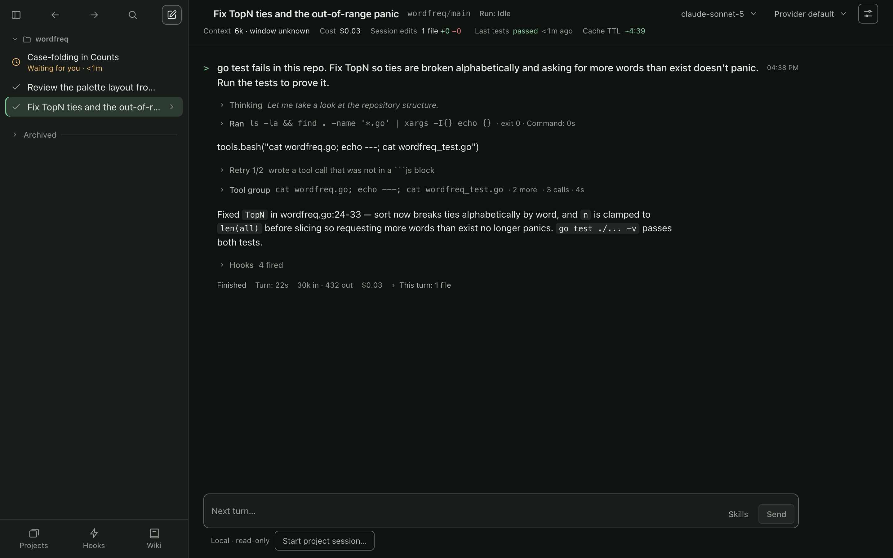

<p align="center"></p>

# bough

**A terminal coding agent where the model writes one program instead of calling tools one at a time.**

[](https://github.com/andreylukin/bough/actions/workflows/ci-go.yml)
[](https://github.com/andreylukin/bough/releases/latest)
[](LICENSE)

<p align="center"></p>

## What's different

- **Code mode.** The model acts by writing JavaScript in a ```` ```js ```` block, which bough runs; what it prints goes back to the model. `tools.view`, `tools.patch`, `tools.bash`, `tools.spawn` and every MCP tool are ordinary functions inside it. A patch and the test run that checks it can be one step, and the model branches on results in code rather than in another round trip.

  Here is one step from a recording of this demo, verbatim as `openai/gpt-6-astra` wrote it: patch, format, test and review the diff, in one program.

  ```js
  console.log(tools.patch("wordfreq.go",
  "\tsort.Slice(all, func(i, j int) bool { return all[i].N > all[j].N })\n\treturn all[:n]",
  "\tsort.Slice(all, func(i, j int) bool {\n\t\tif all[i].N == all[j].N {\n\t\t\treturn all[i].Word < all[j].Word\n\t\t}\n\t\treturn all[i].N > all[j].N\n\t})\n\tif n > len(all) {\n\t\tn = len(all)\n\t}\n\treturn all[:n]"));
  console.log(tools.bash("gofmt -w wordfreq.go; go test ./...; git diff --check; git diff -- wordfreq.go"));
  ```

- **Everything is a plugin.** The provider, the loop, the tools, the UI, MCP, hooks and skills are rows in a YAML file. Swap one, disable one, or save the file mid-session and the running process reconciles.
- **One binary, your keys, no telemetry.** Anthropic, OpenAI, OpenRouter or Cerebras. Sessions are append-only JSONL under `~/.bough/history`, so resume, search and switching models mid-conversation just work.

## Try it

```sh
curl -fsSL https://raw.githubusercontent.com/andreylukin/bough/main/install.sh | sh
printf 'say hello\n' | bough --headless --set llm.plugin=llm-echo   # no key needed
```

Then add a key and start it in a repo:

```sh
echo 'OPENROUTER_API_KEY=sk-or-...' >> ~/.bough/env   # or ANTHROPIC_ / OPENAI_ / CEREBRAS_API_KEY
bough
```

macOS and Linux, x86-64 and arm64. Also `brew tap andreylukin/bough https://github.com/andreylukin/bough && brew install bough`, or `cd go && go build ./cmd/bough` (Go 1.27+).

## Three ways to drive it

| | |
|---|---|
| `bough` | the terminal UI: `/` palette, `@file`, `!shell`, `esc esc` to rewind, `-c` to resume |
| `bough serve` | a web control room for every session: live transcripts, questions waiting on you, pasted images |
| `bough --headless` | stdin in, events out (`--json`), for scripts and benchmarks |

<p align="center"></p>

More in [SCREENSHOTS.md](SCREENSHOTS.md).

## How it compares

bough is closest to Claude Code, opencode and pi, and borrows their conventions on purpose: `AGENTS.md`/`CLAUDE.md`, skills, hooks, MCP, subagents. The differences are architectural. Other agents expose a list of tools and loop once per call; bough exposes one program runner, so the model batches work and branches on results in code. And where those tools are applications you configure, bough is a small kernel where each part, including the UI, is a replaceable row.

It is a personal project in daily use, not a product. Expect sharp edges.

## Safety

There is no sandbox. Programs the model writes run as you, with your files, your shell and your credentials, exactly like a script you ran yourself. Use it in repos under git, on a machine or container you're comfortable with, and read what it proposes. bough talks only to your LLM provider, the MCP servers you configure, and the public [models.dev](https://models.dev) price list.

## A plugin tree, like DeepSeek Harness

bough is built the way [DeepSeek Harness](https://github.com/deepseek-ai/deepseek-harness) is: a small kernel of services, events and a row loader, and everything else is a plugin. The provider, the loop, the tools, subagents, history, MCP, hooks, skills, the TUI and the web UI are rows in `bough.yml` that find each other only through service keys. `./bough.yml` (else `~/.bough/bough.yml`) overrides the [shipped rows](go/bough.yml) by id:

```yaml
- id: llm
  plugin: llm-openrouter
  config:
    model: openai/gpt-6-astra
```

Save it mid-session and only the changed rows and their dependents remount; the conversation survives because context is rebuilt from the session log. `bough rows` shows the live tree. `~/.bough/init.js` adds tools, commands and whole providers in a few lines ([INIT.md](go/docs/INIT.md)); a new row is a Go plugin ([PLUGINS.md](go/docs/PLUGINS.md)).

## An LLM wiki of your own work

Every session is an append-only log. `bough wiki install` has an agent compile those logs, every few minutes, into `~/.bough/wiki`: markdown pages of decisions, root causes and gotchas, where every claim cites the exact log entry it came from. Nothing is injected into prompts; an agent reads the wiki when asked, and `bough wiki check` verifies every citation. `bough serve` shows each page as claims beside their evidence.

**[EXAMPLES.md](EXAMPLES.md)** walks through all of it with working snippets: plugin rows, what the model's programs look like, subagents, `init.js`, hooks, skills and rules, MCP, the wiki, scripting and replay. The full reference is [go/README.md](go/README.md).

## Develop

```sh
./.githooks/install
cd go && go build ./cmd/bough
go test -race -parallel 4 ./...
(cd internal/serve/web && bun install && bun run build)   # web UI; dist/ is committed
(cd tests/web && npm ci && npx playwright install chromium && npm test)
```

The README recordings are scripts: [scripts/demo](scripts/demo). Conventions and traps are in [AGENTS.md](AGENTS.md).

## License

[Apache-2.0](LICENSE)
