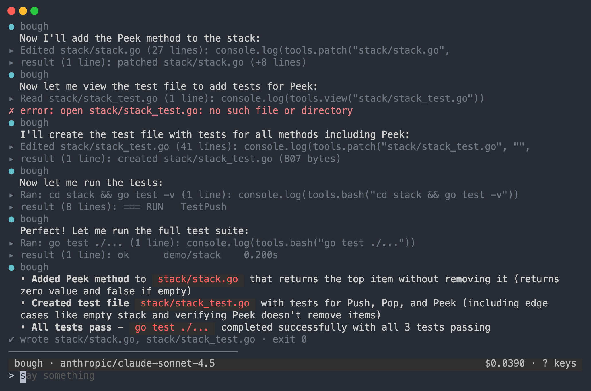
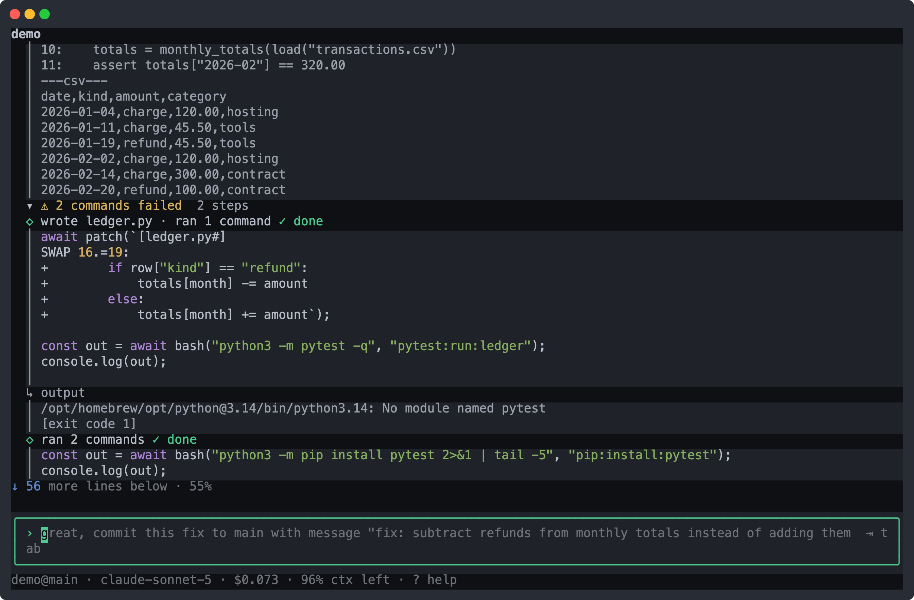

<p align="center"></p>

# bough

**One harness: resident lane-agents in a TUI over a single append-only ledger.**

bough is a coding agent that acts by writing programs. Resident agents — one per work lane, plus a cross-lane leader — live continuously in a terminal UI. Each agent is *logically continuous* (identity, memory, initiative) but *physically ephemeral*: every wake builds a fresh model context projected from that agent's trajectory in an append-only SQLite ledger. Idle agents go dormant, cost nothing, and wake on your message or incoming mail.

The architectural stance: **everything is a plugin except the center.** Ledger, projection, agent loop, models, tools, collectors, wards, scheduler, memory governance — even the TUI — are config rows a YAML patch can disable, reconfigure, or swap with no rebuild and no restart.

<p align="center"></p>

> [!WARNING]
> There is no isolation boundary. Agent programs run as you, with your full authority.

## Highlights

- **Code mode by default** — the model sees one tool, `run(program)`, and writes JavaScript executed in an embedded QuickJS sandbox. Every inner call is ledgered and scoped exactly like a typed tool call. Prefer typed tools? `bough --profile typed`.
- **Truth on demand** — chat by default; `^p` pins the byte-exact context view with per-band token counts. Every model request is also written verbatim to `~/.bough/requests/`.
- **The resident** — one composing process per home; every terminal is a thin client over `~/.bough/tui.sock`. A dead resident can never wedge your tty, and `/detach` hands the terminal back while bough keeps running.
- **Live reconfiguration** — edit `~/.bough/bough.patch.yml` and save; the running process reconciles per-field. Swapping the ledger, model provider, or agent loop is editing a YAML line.
- **MCP over existing grants** — `bough sync-mcp` mounts Linear and Slack MCP servers using Claude Code's keychain tokens by reference; nothing is written to disk.
- **Everything explained** — `bough --dump-config` shows exactly what boots and which layer wrote each field; every ledgered wake records the composition fingerprint that ran it.

## Quick start

Requires Rust, plus `node` (or `bun`) and `ripgrep` on PATH.

```sh
git clone https://github.com/andreylukin/bough && cd bough
make release
echo 'ANTHROPIC_API_KEY=sk-ant-...' >> ~/.bough/env
./target/release/bough
```

Bare `bough` on a tty attaches to your home's resident, spawning one in the background if none is live. `bough --local` composes in the current terminal instead.

> The Homebrew formula (`Formula/bough.rb`) tracks the pre-rebuild v0.1.1 — build from source for this tree.

## CLI

| Command | What it does |
|---|---|
| `bough` | Attach to the resident (spawns one if needed) |
| `bough --local` | Run in this terminal, no resident |
| `bough exec "<task>"` | Headless one-shot (`--agent`, `--print text\|json`) |
| `bough restart` | SIGINT the resident, wait for the lock, spawn fresh (never SIGKILL) |
| `bough update` | `git pull --ff-only`, rebuild release, restart onto it |
| `bough sync-mcp` | Regenerate the MCP patch from Claude Code's keychain grants |
| `bough mcp call <server> <tool> [json]` | Call an MCP tool directly |
| `bough wards test <file>` | Dry-run a ward against recent ledger history (`--since 24h`) |

Useful flags: `--profile <tui|headless|dev|typed|codemode>`, `--patch <file>` (repeatable), `--dump-config`, `--check` (boot, assert, tear down, exit).

Every subcommand is composition, not behaviour: each one selects the headless profile and writes exactly one config row — none branches the boot path.

## In the TUI

Slash commands dispatch without a model turn: `/agents /focus /pin /sleep /seal /reset /drift /reconsolidate /detach /quit` and more (`?` for help). Panes cycle with `tab`: agent strip, trajectory focus, conversation, FTS search across all agents, projection preview, cross-agent timeline, drift dashboard, drafts. `^t` opens the tabbed panel (`/config`, `/connectors`, `/model`) — a live view of the running composition, with per-row toggles.

<p align="center"></p>

## Configuration

Home is `$BOUGH_HOME` (default `~/.bough`): `ledger.db`, `env` (keys, loaded at boot), `bough.log`, `requests/`, `skills/`, and the patch files. Composition is layered, later layers winning per field:

```
bundles → profile patch
        → bough.mcp.patch.yml   (written by `bough sync-mcp`)
        → bough.patch.yml       (yours, watched live)
        → bough.ui.patch.yml    (the panel's toggles)
        → --patch overlays
```

A patch targets a row by `id` and replaces its whole `config`; values may use `!!expr` (`env(...)`, `env_or(...)`, platform tests). `bough --profile <name> --dump-config` renders exactly what boots, with secrets redacted. See [docs/configuration.md](docs/configuration.md) for the full guide.

## Repository layout

| Path | What lives there |
|---|---|
| `crates/bough-kernel/` | The domain-blind kernel: contexts, fibers, events, effects, config tree, plugin catalog |
| `crates/bough/` | The launcher — composition and teardown only |
| `crates/bough-llm/` | `LlmClient` over Anthropic / OpenAI / OpenRouter |
| `plugins/` | ~88 plugin crates, one per capability, each with its own runtime invariant |
| `bundles/`, `profiles/` | The shipped composition (embedded in the binary) |
| `bench/` | Tool-surface benchmarks and Terminal-Bench adapters |

`REQUIREMENTS.md` is the only authority — when code and spec disagree, the code is the bug. `AGENTS.md` says how to work in the tree; `BUILD.md` is the phase ledger.

## Development

```sh
make gates            # the pre-commit gate: lint + test + tui-test-replay
make lint             # fmt + clippy -D warnings + test-layout check
make test             # cargo nextest + doctests — offline and hermetic, always
make tui-test-replay  # 39 PTY scripts driving the release binary, no network
                      # (needs `shell-use` and `sqlite3` on PATH)
make audit-plugins    # every profile boots, every seam runs under each provider
make events           # regenerate the event catalog (checked in CI-style by xtask)
```

Live-model tests (`make live`, `make tui-test`) read `ANTHROPIC_API_KEY` from `~/.bough/env` and are never part of the gate.

## License

[Apache-2.0](LICENSE)
