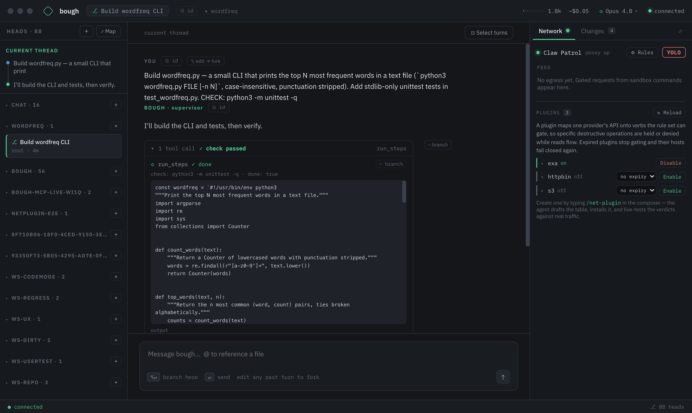
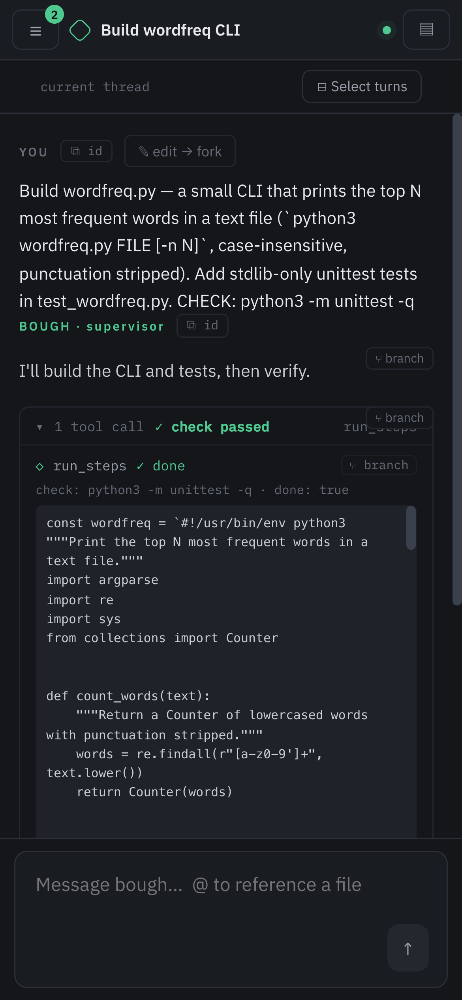
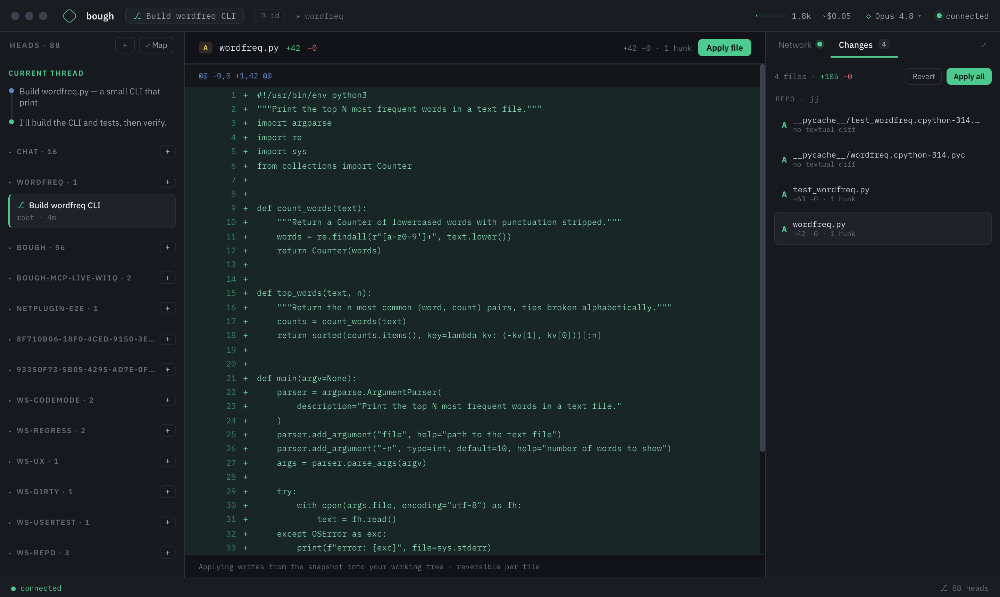

<p align="center">
  
</p>

<h1 align="center">bough</h1>

<p align="center">
  <b>A sandboxed coding agent with branchable history.</b><br>
  <i>A tree you tend in the dark — fork any point, and the filesystem forks with it.</i>
</p>

<p align="center">
  
</p>

bough runs a frontier model as a **supervisor** that plans by writing code. A deterministic harness executes that code in a sealed V8 worker, confines spawned processes with a **macOS Seatbelt** profile, and routes outbound network through a default-deny egress gate. Every turn is a node in a tree you can **fork** — restoring the conversation *and* the files. TypeScript on Deno; headless server with a React web UI.

## Why bough

- 🌳 **Branchable history, branchable files.** Fork any earlier turn and the workspace reverts with it — explore a risky change, jump back if it goes wrong.
- 🔒 **Safe to leave running.** Every command runs under a kernel sandbox: workspace-only writes, `~/.ssh`/`~/.aws` and other secrets denied, network default-deny with a live allow/deny leash.
- ⚙️ **Code-mode.** The supervisor writes a small program each turn (`bash`/`read`/`write`/`edit`) instead of one-shot tool calls — loops, composition, real control flow.
- ✅ **Deterministic done.** A turn is "done" only when a committed `CHECK` command exits 0 — not when the model says so.

## Run

`scripts/bough setup` bootstraps a fresh Mac (deps, web build, worker model, the `bough` CLI) and installs the server as a launchd user service: starts at login, relaunches on crash, never watches files — editing the repo doesn't touch the running server until you restart.

```bash
scripts/bough setup                    # one-time: deps + web build + env (prompts for the key) + start
bough start                            # serves http://127.0.0.1:4321 (logs: ~/.bough/server.log)
bough kill | restart | status | logs   # manage the service (kill sticks across logins)
bough update                           # fast-forward to origin/main, rebuild, restart
```

Or run it in the foreground — requires [Deno](https://deno.com). From the repo root:

```bash
export ANTHROPIC_API_KEY=sk-ant-...
deno task dev                          # serves http://127.0.0.1:4321
```

To drive it from a phone, set a password (auth on, LAN bind) and open a tunnel:

```bash
BOUGH_PASSWORD=... deno task dev       # terminal 1
deno task tunnel                       # terminal 2 — prints a public trycloudflare URL
```

<p align="center">
  
</p>

## Use it

Point a session at a repo and ask. The supervisor plans, the sandbox runs the work, and `CHECK` decides when it's done — every turn snapshotted, so history and files fork together.

- **Branch anything.** Edit any past turn to fork from that point, or compact a span of turns into a summarized branch; the heads map lays the whole tree out.
- **Review what changed.** The Changes rail shows the run's uncommitted work as diffs — apply per file or revert, before anything touches your tree for keeps.

<p align="center">
  
</p>

- **Own the network.** The Network rail is a live feed of gated egress; a request outside policy pauses as a *hold* you allow or deny from the UI. Installable policy **bundles** (e.g. `github`) grant scoped access with credential injection, so tokens never enter the sandbox.
- **Local worker.** A small local model (Qwen2.5-Coder-3B via `llama-server`) handles delegated fixes for free, gated by `CHECK`.

## How it works

- **One tool.** The supervisor's only tool is a JS program per turn, executed in a fresh Deno Worker with `permissions: "none"` — a sealed V8 isolate; only `bash`/`read`/`write`/`edit` bridge out.
- **Two fences.** The worker isolate confines the agent's program; a macOS Seatbelt profile confines the processes it launches.
- **Gated egress.** Outbound traffic is matched against policy; misses hold for a human verdict. Policies ship as parameterized bundles.
- **Snapshots.** Each turn checkpoints the workspace ([jj](https://github.com/jj-vcs/jj) for repos, APFS clonefile for config); a fork restores it.
- **Headless server + web UI.** One Deno process serves the JSON API, an SSE event stream, and the built React UI on `:4321` — same origin, phone-friendly, optional password gate for remote use.

## Develop

```bash
deno task test            # unit + integration tests
deno task check           # typecheck
cd web && npm run build   # rebuild the web UI (server serves web/dist)
```
