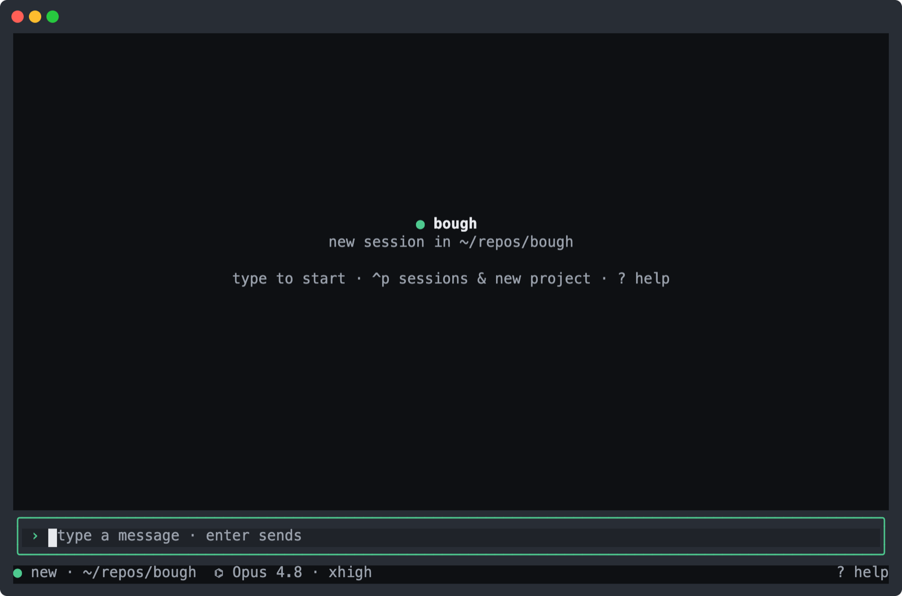
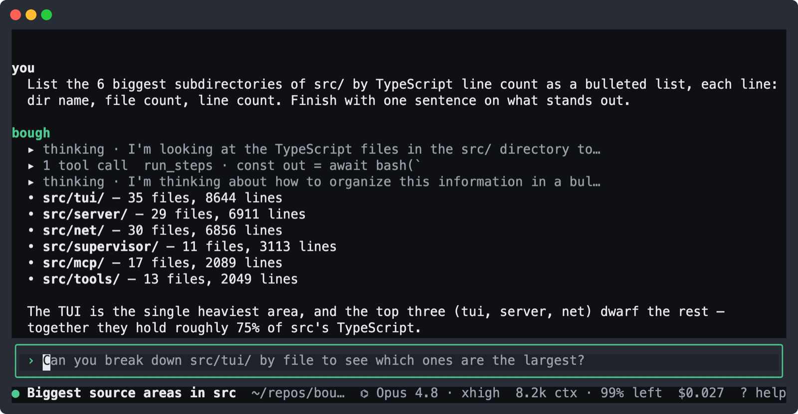
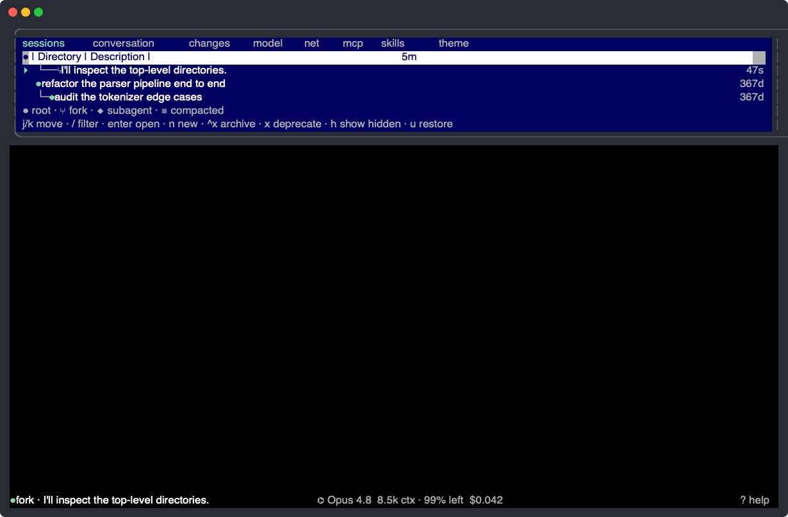
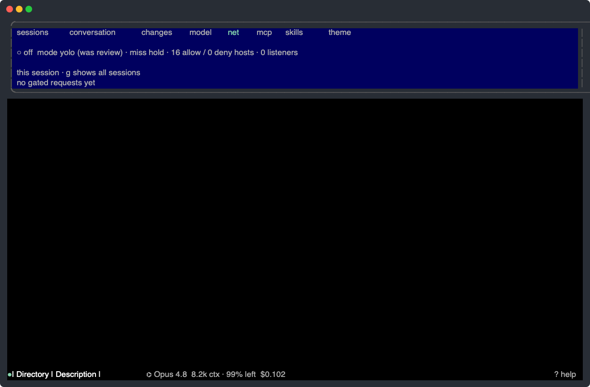
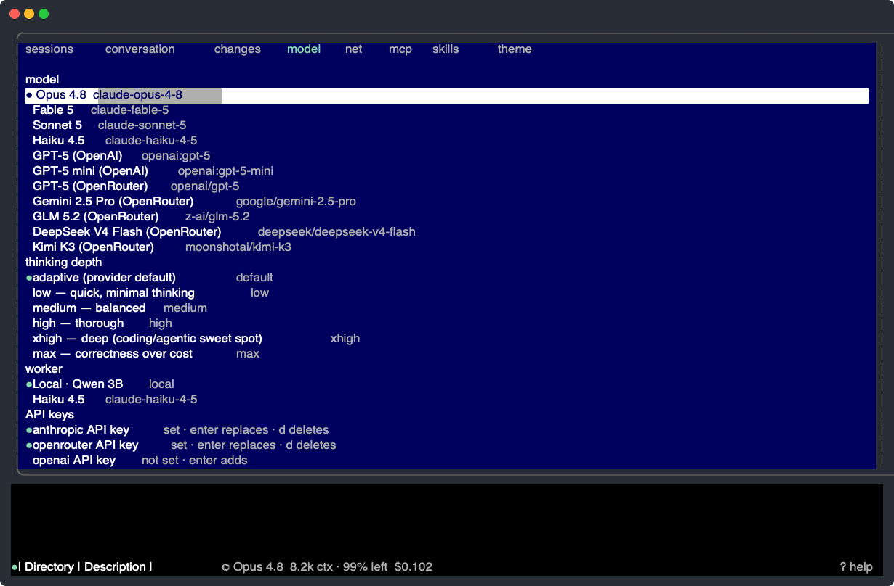

<p align="center">
  
</p>

<h1 align="center">bough</h1>

<p align="center">
  <b>A sandboxed coding agent with branchable history.</b><br>
  Fork any point in the conversation — the filesystem forks with it.
</p>

bough runs a frontier model that plans by writing code. A deterministic harness executes each turn in a sealed V8 sandbox, confines spawned processes with a macOS Seatbelt profile, and gates all outbound network behind a human-held leash. Every turn is a node in a tree: rewind, fork, and the files come with you.

<p align="center">
  
</p>

## Why bough

- 🌳 **Branchable history, branchable files.** Fork any earlier turn and the workspace reverts with it — try the risky idea, jump back if it fails.
- 🔒 **Safe to leave running.** Kernel sandbox: workspace-only writes, secrets unreadable, network default-deny behind a live allow/deny leash.
- ⚙️ **Code-mode.** One small JS program per turn instead of one-shot tool calls — loops, composition, real control flow over shell, files, subagents, MCP, and LSP.
- ✅ **Deterministic done.** A turn is done only when a committed `CHECK` command exits 0 — the model can't grade its own homework.

## Run

macOS only (the sandbox is Seatbelt). One line clones to `~/bough` and sets everything up — deps, worker model, API key, launchd service:

```bash
/bin/bash -c "$(curl -fsSL https://raw.githubusercontent.com/andreylukin/bough/main/install.sh)"
```

## Use it

Point a session at a repo and ask in plain language. bough plans by writing a small program, runs it in the sandbox, and answers — folded reasoning, the code it ran, live cost and context all in one view. It even predicts your likely next message.

<p align="center">
  
</p>

**Fork anything.** Edit a past turn to branch from that point; history and files fork together. Sessions spawn subagents as real branches, and the tree shows the whole forest — every root, fork, and subagent — at a glance.

<p align="center">
  
</p>

**Own the network.** Every outbound request is caught at the proxy and shown as a live feed — allow, deny, or hold it. Policy bundles grant scoped access with credential injection at the proxy, so tokens never enter the sandbox.

<p align="center">
  
</p>

**Everything else in one panel.** Sessions, tree, changes review, model picker, net, MCP, skills, themes — `^t` toggles it, `^p`/`^f`/`^d`/`^o` jump straight to a tab. Swap the frontier model or thinking depth mid-session; a tiny local model handles the harness's micro-tasks for free.

<p align="center">
  
</p>

Plus: an `oracle()` second opinion, `ship()` to land commits in your own repo with your credentials, artifact publishing at a URL, transcript search, and `@` files / `/` skills in the composer.

## How it works

- **One tool.** The supervisor's only tool is a JS program per turn in a Deno Worker with `permissions: "none"`; host functions bridge out (`bash`, `read`/`write`/`edit`, `oracle`, `agent`/`spawn`/`adopt`, `mcp`, `lsp.*`, `ship`).
- **Two fences.** The isolate confines the program; a Seatbelt profile confines the processes it launches — workspace-only writes, secret directories denied, network loopback-only while the proxy runs.
- **Snapshots.** Each turn checkpoints into a per-project shadow git store — one worktree per session, origin history grafted in, `node_modules` hydrated via clonefile. Your repo's `.git` is never touched.
- **Headless server + TUI.** One Deno process serves the JSON API, SSE events, and hosted artifacts on `:4321`; the terminal UI drives it. State lives in SQLite at `~/.bough/bough.db`.

## Develop

```bash
deno task test    # unit + integration tests
deno task check   # typecheck
deno task tui     # the terminal UI against the local server
```

`bench/` A/B-tests the harness against Claude Code on a fixed task bank; `probes/` measures TUI responsiveness against the live server. More in `docs/`.
<!-- guest-owned workspace live push test 2026-07-23 -->
