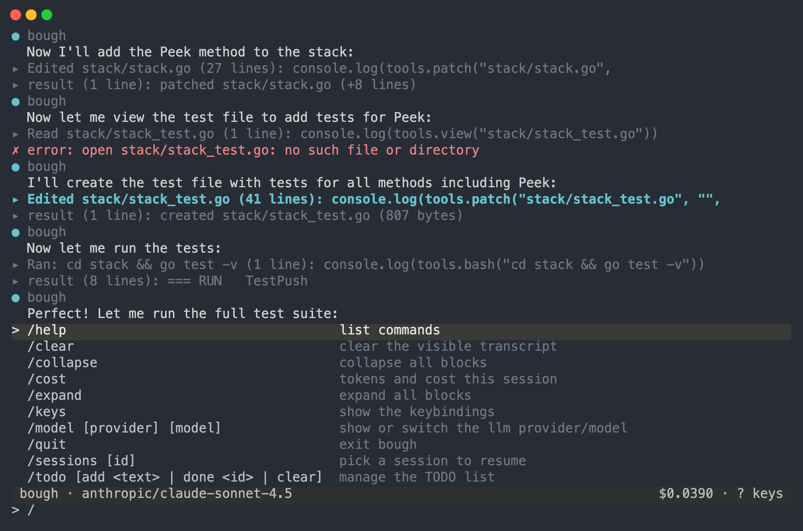

<p align="center"></p>

# bough

**A coding agent that acts by writing programs, in a terminal, where everything is a plugin.**

[](https://github.com/andreylukin/bough/actions/workflows/ci-go.yml)
[](https://github.com/andreylukin/bough/releases/latest)
[](LICENSE)

The model sees one tool: it writes JavaScript, bough runs it, and whatever the program prints goes back to the model. Every `tools.*` call inside that program is a normal function call, so a read, an edit, and a test run can happen in one round trip instead of three. The kernel is small; the LLM provider, the loop, the tools, the UI, memory, MCP, hooks, and skills are all rows in a YAML config that you can swap, disable, or hot-reload while a session is running.

<p align="center"></p>

> [!WARNING]
> There is no isolation boundary. Agent programs run as you, with your full authority.

## Highlights

- **Code mode** — one `run(program)` surface. `tools.bash`, `tools.view`, `tools.patch`, `tools.spawn`, `tools.ask`, `tools.todo`, `tools.graph.*`, and any MCP tool are JS functions in one persistent [goja](https://github.com/dop251/goja) VM.
- **Everything is a plugin** — `bough.yml` is a list of rows `{id, plugin, config}`. Rows mount when their service deps are provided, remount when a dep changes, and reconcile live when the file is saved. `bough rows` prints the state table.
- **Sessions are an append-only log** — every turn appends to a JSONL file under `~/.bough/history/`; model context is projected from the log each step, so resume, provider swaps mid-conversation, and inspection all come for free (`-c`, `-r`, `bough log`, `ctrl+o`). On a long turn the projection shows the model the recent tool outputs whole and only the head of older ones, which halves the context without summarising anything — the log keeps every byte (`keep_whole_results`).
- **Claude Code parity where it matters** — subagents as one live card per spawn, an interactive `/todo` list, `tools.ask` questions with clickable options, `!cmd` shell lines, `@file` attachments, a fuzzy `/` palette, hooks, skills, and `AGENTS.md`/`CLAUDE.md` context files.
- **Long-term memory** — a bi-temporal property graph in SQLite (`~/.bough/graph.db`). Nothing is deleted; contradictions close a validity window. See [go/docs/graph-memory.md](go/docs/graph-memory.md).
- **Cost in the status bar** — every provider's token tally is priced (OpenRouter passes its own price through; Anthropic and OpenAI use a built-in table). `/cost` says where the number came from.
- **Three UIs, one model** — the native TUI (bubbletea), the same UI in a browser (`bough web`), and `--headless` for pipes and scripts.

## Install

macOS and Linux, x86-64 and arm64. One static binary, no runtime to install
alongside it: code mode runs JavaScript in-process and SQLite is pure Go.
(Windows compiles in CI but ships no binary and is untested — see
[Windows](#windows).)

```sh
curl -fsSL https://raw.githubusercontent.com/andreylukin/bough/main/install.sh | sh
```

<details>
<summary>Homebrew, or from source</summary>

```sh
brew tap andreylukin/bough https://github.com/andreylukin/bough
brew install bough
```

```sh
git clone https://github.com/andreylukin/bough && cd bough/go
go build -o ~/.local/bin/bough ./cmd/bough      # needs Go 1.27+
```

The installer takes `BOUGH_VERSION` to pin a tag and `BOUGH_INSTALL_DIR` to
choose where the binary lands (default `~/.local/bin`). Release archives and
their `checksums.txt` are on the [releases page](https://github.com/andreylukin/bough/releases);
the installer verifies the checksum when both are present.

</details>

Then give it a key and run it — or start bough first and use `/connect
<provider> <key>`, which records the key and switches to it without
leaving the session:

```sh
mkdir -p ~/.bough && echo 'ANTHROPIC_API_KEY=sk-ant-...' >> ~/.bough/env   # or OPENROUTER_API_KEY / OPENAI_API_KEY / CEREBRAS_API_KEY
bough
```

Any one of those four is enough: with no `bough.yml` of your own, bough runs
whichever provider you have a key for. `/model` switches at any time.

`~/.bough/env` is read at boot, so keys never need to be in your shell. No key handy? The echo provider proves the loop works:

```sh
printf "say CODE! please\n" | bough --headless --set llm.plugin=llm-echo
```

## In the TUI

`/init` is a good first command in a repo you have not used bough in: it reads
the project and writes an `AGENTS.md` briefing, which every later session picks
up as context. It is an ordinary prompt template — copy it to
`.bough/prompts/init.md` and edit it if you want it to ask for something else.

Type a task. The model's programs render as collapsed one-line headers (`▸ Ran: go test ./...`, `▸ Edited stack/stack.go`), click or press `enter` on one to open it. A finished turn ends with a chip: the files it wrote and the last exit code.

<p align="center"></p>

| Input | What it does |
|---|---|
| `/` | fuzzy palette over every command (`/init`, `/connect`, `/model`, `/sessions`, `/export`, `/todo`, `/cost`, `/keys`, …); `tab` completes, `enter` runs |
| `!cmd` | run a shell command directly, output boxed in the transcript, never sent to the model |
| `@path` | attach a file; a picker opens as you type |
| `ctrl+c` | cancel the running turn (kills the process group); press again to quit |
| `ctrl+o` | history inspector; on a focused subagent card, dive into the child's transcript |
| `tab` / `shift+tab` | move the block cursor (newest first); `enter` toggles the focused block |
| `shift+enter` | newline in the composer; `↑`/`↓` (or `ctrl+p`/`ctrl+n`) move the cursor, then recall earlier prompts — this directory's previous sessions included |
| `esc` | clear the draft (`↑` brings it back), close the palette, decline a pending `tools.ask` question |

<p align="center"></p>

Keys are remappable and colors are themeable from `~/.bough/init.js`:

```js
bough.setup({
  ui: {theme: {accent: "#7aa2f7"}, keymap: {quit: "ctrl+q"}},
  system: {append: "reply tersely"},
});
bough.tool("shout", (s) => s.toUpperCase());               // a codemode tool
bough.command("shout", "<text>", "uppercase", (a) => a.toUpperCase());
bough.provider("parrot", (sys, msgs) => "...");             // a full LLM provider
```

## CLI

| Command | What it does |
|---|---|
| `bough` | start the TUI in the current directory |
| `bough -c` / `bough -r [id]` | resume the most recent session, or pick one |
| `bough --headless` | stdin lines in, `[kind] text` events out; exit 1 if any turn errored |
| `bough web [addr]` | start the browser UI detached and open it (`web status`, `web stop`) |
| `bough --set llm.model=…` | override any row's config; `id.plugin=name` swaps the plugin |
| `bough rows` | the live row state table (`pending` / `active` / `failed` / `disabled`) |
| `bough sessions` / `bough log [file]` | list sessions, pretty-print a history |
| `bough mcp list \| tools \| search \| status \| call` | MCP servers and their tools, from the CLI |
| `bough sync-mcp` | adopt Claude Code's MCP OAuth grants by keychain reference |
| `bough graph stats \| backfill \| search \| neighbors \| timeline` | the memory graph |
| `bough update` / `bough restart` | `git pull --ff-only`, rebuild in place (source checkouts; use your installer otherwise), bounce the web session |

`bough --help` has the full list; `--dump-config` mounts the tree, prints it, and exits.

## Configuration

`./bough.yml`, else `~/.bough/bough.yml`, else an embedded default. It is a list
of rows. [go/bough.yml](go/bough.yml) is the shipped tree, commented row by row;
abridged, it reads:

```yaml
- id: llm
  plugin: llm-anthropic         # or llm-openrouter, llm-openai, llm-cerebras, llm-echo
  config:
    model: claude-sonnet-5
    # max_tokens: 16384         # cap on one reply
- id: cost
  plugin: cost
- id: codemode
  plugin: codemode
- id: tools
  plugin: tools-basic
- id: workers                   # tools.spawn: bounded child agents, depth 1
  plugin: workers
- id: history                   # durable JSONL; delete the row and it is in-memory
  plugin: history
- id: mcp                       # stdio servers from config, ./.mcp.json, ~/.claude.json
  plugin: mcp
- id: connect                   # /connect: add a provider key mid-session
  plugin: connect
- id: prompts                   # Markdown prompt templates, and /init
  plugin: prompts
- id: loop
  plugin: loop
- id: graph
  plugin: graph
- id: ui
  plugin: ui
```

With no `bough.yml` of your own, the `llm` row follows whichever provider key you
have — the tree above is what you get once you write one down.

Save the file and the running process reconciles per row: changed rows and their dependents remount, added rows mount, a row whose deps are missing waits as `pending`, a row that fails is isolated as `failed`. A file that fails to parse keeps the last good tree.

Hooks are `.js` files under `~/.bough/hooks/<event>/` (`session-start`, `user-prompt-submit`, `pre-code-exec`, `post-result`, `stop`, `session-end`), re-read on every fire. Skills are `~/.claude/skills/<name>/SKILL.md`, injected when their name appears in your message.

Writing your own row is [go/docs/PLUGINS.md](go/docs/PLUGINS.md) — a walkthrough of
[a working example plugin](go/plugins/example/example.go) that ships in the binary.

The full reference, including the service-key table, the history and projection model, subagent and ask semantics, and the three test layers, is [go/README.md](go/README.md).

## Windows

Not supported yet, but no longer out of reach. The tree compiles for
`windows/amd64` and `windows/arm64` on every push — the process-group and
signal calls that were Unix-only now sit behind build tags — and nothing
else in bough is POSIX-specific.

The test suite now runs there too, and says plainly where it stands: **79 of
them fail**. The job is in CI but does not gate a merge, so the list is
enumerated rather than imagined.

From the first run, most of what fails looks like assumptions in the tests
rather than in bough: paths written into JSON fixtures without escaping the
backslashes, and comparisons against text a CRLF checkout had rewritten (now
addressed by `.gitattributes`). Underneath those, the real gaps are known:
`tools.bash` pipes its script to `sh`, so it needs Git for Windows (or another
`sh`) on `PATH`; `bough web`'s new-session signal has no Windows equivalent;
and the process tree is killed with `taskkill /T` rather than a process group.

No release binary is published, because "it builds" is not "it works" and 79
failures is not "it works" either. If you use Windows, the CI log is the todo
list and a pull request against any of it is welcome.

## Repository layout

| Path | What lives there |
|---|---|
| `go/kernel/` | services, events, effects, the loader, row lifecycle. The only non-plugin code besides the launcher |
| `go/cmd/bough/` | the launcher: flags, config discovery, hot reload, subcommands |
| `go/plugins/` | llm, codemode, loop, tools, workers, ui, history, graph, memory, mcp, hooks, skills, prompts, todo, ask, connect, cost, commands, initjs, contextmd, scratch, theme, title, activity — and `example`, the worked plugin from [docs/PLUGINS.md](go/docs/PLUGINS.md) |
| `go/e2e/`, `go/internal/` | headless and PTY end-to-end suites, shared LLM stubs, the real-terminal suite |
| `go/docs/` | `PLUGINS.md` (writing a plugin), `INIT.md` (the init.js API), `graph-memory.md` (the memory graph design) |
| `bench/harbor/` | Terminal-Bench 4.0 via Harbor on Modal |

## Development

```sh
cd go
go build ./cmd/bough
go test -race ./...                              # unit, teatest, headless + PTY e2e
go test ./plugins/ui -run Prop -rapid.checks=2000 # property tests over the TUI model
go test ./internal/vtreal                        # the binary on a real PTY (needs tmux)
cd tests/web && npm ci && npx playwright install chromium && npm test
```

Every test gets its own temp HOME and a deterministic LLM (`llm-echo` or a JS provider from `init.js`); nothing touches `~/.bough` or the network. CI runs the Go layers and a four-shard Playwright matrix on every push that touches `go/`.

## License

[Apache-2.0](LICENSE)
