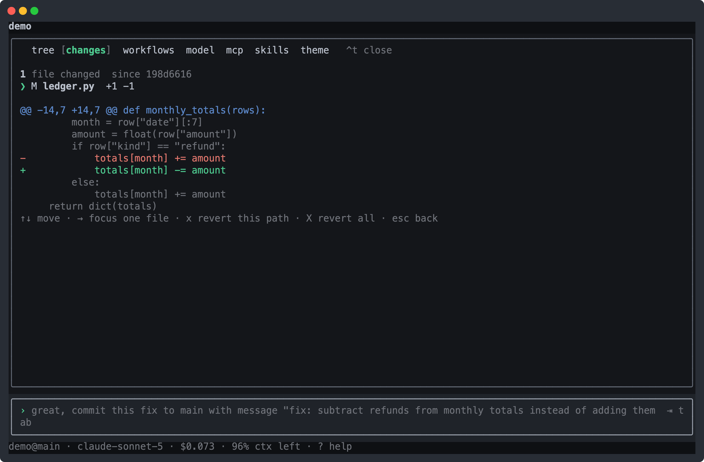
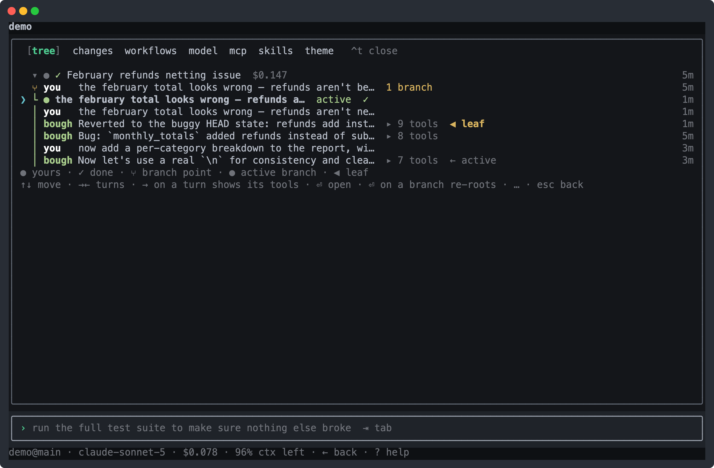

<p align="center">
  
</p>

<h1 align="center">bough</h1>

<p align="center">
  <b>A coding agent that acts by writing programs.</b><br>
  One JavaScript program per round — loops, branching, composition — run against your real checkout.
</p>

<p align="center">
  
</p>

Most harnesses let the model emit one tool call and wait. bough gives it a single tool that takes a
program: the model writes JavaScript with real control flow, and a harness executes it on your
machine. A headless server owns all state and execution; the terminal UI is a view over it.

bough is an alternative harness **design**, not a better coding agent. That distinction is the point
of the project, and this README tries not to blur it.

> [!WARNING]
> **There is no isolation boundary.** Programs run as you, with your full authority — filesystem,
> network, subprocesses, `npm:` imports. No sandbox, no egress proxy, no credential gating. Host
> functions are convenience and session integration, never a wall.
>
> This is a deliberate choice, not an unfinished one ([spec §2](docs/spec.md)): the harness edits
> your real files because reviewing `git diff` and pushing with your own git is the delivery
> mechanism. Run it only on a machine where you would be comfortable running the code it writes,
> because that is exactly what happens.

## The idea

- **One program per round.** The model's only action is `run_steps(code)`. Control flow lives in the
  program, not in a chain of round-trips.
- **In place.** The agent edits your own checkout — no copy, no overlay. The Changes rail is
  `git diff` against the sha the session started from; you deliver with `git commit` / `git push`.
- **History is a tree.** Fork any turn, compact a span onto a new branch, lift messages into a fresh
  root. Nothing is destructively rewritten — every operation produces a new branch.
- **The server is the system.** State, execution, and orchestration are server-side. A client can
  crash or detach without affecting a running turn.
- **Delegation is core.** Subagents and workflows are primary capabilities with real persistence,
  lifecycle control, and observability.

## Install

macOS or Linux:

```bash
/bin/bash -c "$(curl -fsSL https://raw.githubusercontent.com/andreylukin/bough/main/install.sh)"
```

That clones into `~/bough` (override with `BOUGH_DIR`) and runs `scripts/bough setup`, which
installs the toolchain (Rust via rustup, plus `node`, `ripgrep` and `uv` from Homebrew / `apt-get` /
`dnf` / `pacman`), builds the release binary, links `bough` into `~/.local/bin`, and writes an env
template. Already have a clone? Run `scripts/setup.sh` directly. Then:

```bash
$EDITOR ~/.bough/env      # ANTHROPIC_API_KEY=…  (OPENAI_/OPENROUTER_/CLOUDFLARE_ keys optional)
bough start               # background service: starts at login, restarts on crash
bough                     # the TUI (auto-starts the server if it is down)
```

The service manager is the only platform-specific piece — launchd on macOS, a systemd **user** unit
on Linux, a plain background process where there is no user systemd (containers, WSL1). There is no
file watcher: editing code lands only on an explicit `bough restart`.

**Other commands.** `kill`, `restart`, `update` (fast-forward `origin/main` and restart), `status`,
`logs`, `run` (foreground server), `purge`, `sync-mcp` (adopt Claude Code's MCP servers), `tags`
(what the command memory knows).

**Scripting.** `bough exec [-w dir] [-m model] [--json] "do the thing"` creates a session, streams
the assistant's text to stdout, and exits 0 on a completed turn, 1 on an errored one, 2 on a usage
or connection problem.

**Environment.** `BOUGH_HOME` relocates the whole data root (`~/.bough`) and `BOUGH_PORT` moves the
listener, so a development instance never touches a live install. `BOUGH_MODEL` and
`BOUGH_CHEAP_MODEL` set the default and cheap-tier models (both also settable in the picker).

## Use it

Point a session at a repo and ask in plain language. bough writes a small program, runs it, and
answers — folded reasoning, the code that ran, live cost and context in one view. Unfold a step
(`^e`) and you see the actual program and its output:

<p align="center">
  
</p>

### The program environment

Host functions are pre-injected globals; the program also has the full JS runtime (`bun` if
installed, else `node`) and may ignore all of them.

| | |
|---|---|
| Shell | `bash` (auto-backgrounds past 60s, never killed) · `sh` for concurrent commands · `bashBg` / `bashOutput` / `bashWait` / `bashKill` |
| Files | `view` → numbered lines with a version tag · `patch` → hash-anchored line edits · `write` for new files |
| Delegation | `agent` (blocking) · `spawn` (detached) · `join` · `adopt` · `workflow.*` |
| Session | `ask` a human mid-program · `state.*` durable KV · `schedule.*` · `artifact` |

### One editing idiom

`patch` names lines instead of quoting them, so code being edited never has to survive the model's
own string escaping. The tag pins the version that was viewed: if the file moved on but the patched
lines are untouched, the edit rebases; if they *were* touched, it reports a conflict. With subagents
sharing one checkout, that is the primary safeguard against silent clobbering.

### Review and deliver

The Changes rail (`^d`) is `git diff` against the sha the session started from — per-file, revertable
per path, and never a staging area of its own. You commit and push with your own git.

<p align="center">
  
</p>

### History is a tree

Rewind to any turn and send something else, and the old line survives as a branch (`^f`). Compacting
a span or lifting messages into a fresh root works the same way — a new branch, never a rewrite.

<p align="center">
  
</p>

### Memory across sessions

Every `bash` call carries tags naming what it is *for* —
`bash("cargo test -p bough-tui", "cargo:test:composer")` — and every finished command is recorded
under them: command, exit code, duration, the first 2k chars it *printed*, and the directories it was
about. Labeling intent at generation time is nearly free and far more accurate than clustering
command strings after the fact, and the exit code is the ground truth that weights the label. The
scope key is the repo a command *touched* — git origin URL, else path — so a session rooted at `~`
still files into the right project.

Recall runs both ways:

- **The harness primes.** A session opens with the project's own tag vocabulary — weighted by
  success and a 30-day recency half-life, then damped by how many *other* projects use the same word,
  so the list is the subjects this repo talks about rather than the tool names every repo shares. A
  round that reaches into a new directory gets one dim `[history]` line naming what past sessions
  tagged there.
- **The program pulls.** There is no memory host function — the program runs `bough tags` in the
  shell: `show TAG` for what worked, `sql "SELECT …"` for anything else, `similar "text"` where the
  vector layer exists. One door for the model and the human, and nothing to keep in step with a bridge.

`bough tags sql` is a read-only SELECT (`query_only` on, against the live database) over
`command_history`, its tag and directory junctions, and an FTS index covering *output* as well as
invocations — so "what did that migration actually print" is answerable without re-running it. It is
the same `~/.bough/bough.db` that holds the transcripts, which is why the bundled `history` skill
answers across both through the same command. `bough tags similar` adds KNN recall: `sqlite-vec` +
`sqlite-lembed` embed with a local MiniLM *inside* SQLite, into a separate `~/.bough/embeddings.db`
— no native module, no subprocess, no API call.

A tag with a DOT is a **reference** — `linear.eng-1234`, `pr.456`, `commit.3c1c78e` — pointing at
something with an identity outside bough. Same table and joins as any other tag, so a ticket recalls
the commands run for it; but references are excluded from the priming note, because an id lives in
exactly one project and the rarity boost would float last week's ticket numbers above the vocabulary.
Every row also points at the message whose program ran it, so recall reaches the ROUND, not just the
incantation.

For the human, `bough tags` prints the project's vocabulary with the arithmetic the priming note
ranked it by, `bough tags show TAG` what worked under one, and `bough tags stats` coverage and
vocabulary per day — which is how you tell whether a prompt change made the model name more things or
just repeat itself.

### Fan out

`agent()` runs a subagent to completion and returns its report; `spawn()` detaches one that reports
back as a system note. For bigger fan-outs, a **workflow** is a script that runs detached from the
turn, with `agent` / `parallel` / `pipeline` primitives and schema-validated results. Every `agent()`
call is journaled before it runs, so a stopped run loses no completed work and a relaunch replays the
unchanged prefix instead of paying for it twice.

### MCP is a command, not a verb

There is no MCP host function: a granted server's tool is called with
`bough mcp call SERVER TOOL '{"arg":"value"}'` through the shell, and the turn's prompt carries the
catalog of what is connected. Registering, granting and authorizing stay the human's — `bough mcp` on
its own says what every server's state is.

### Everything else in one panel

Sessions, conversation tree, changes review, model picker, MCP, skills, themes — each with a
direct-jump key. Models route to Anthropic, OpenAI, or OpenRouter by id prefix, and the picker's
catalog is what the server's keys can actually reach, not a compiled-in list; a cheap tier handles
titles, ghost text, and activity blurbs and fails silently when it can't.

Plus: artifact publishing at a URL with a comment layer, keyword search across transcripts, `@` files
and `/` skills in the composer, and recurring runs on a schedule. Four skills ship bundled —
`history`, `wayfinder`, `domain-modeling`, `grilling` — and `~/.bough/skills` holds your own. Project
rules come from `AGENTS.md`, read per turn from the git root down.

## How it works

```
┌──────────────┐  HTTP + SSE   ┌──────────────────────────────────────┐
│ TUI (ratatui)│ ─────────────▶│  server  (Rust, 127.0.0.1:4321)      │
│  CLI (exec)  │ ◀──────────────│  ├─ turn runner                      │
└──────────────┘   events      │  ├─ program sidecar                  │
                               │  ├─ workflow sidecar                 │
                               │  ├─ SQLite  ~/.bough/bough.db        │
                               │  └─ artifacts  ~/.bough/artifacts/   │
                               └──────────────────────────────────────┘
```

- **Server** — one Rust process: JSON API, SSE event stream, static artifact hosting. Loopback only,
  no auth layer.
- **Program sidecar** — a fresh JS process per round, inheriting the server's full authority. Host
  functions bridge over a line protocol on its pipes. The sidecar exists to give the program a clean
  global scope and a cancellable lifetime, not to contain it.
- **Workflow sidecar** — a JS process running one orchestration script. A scripting surface, not a
  sandbox: bound to `agent()` / `phase()` / `log()` / `parallel()` / `pipeline()`, and starved of
  ambient nondeterminism (`Date.now`, `Math.random`) so journal replay stays sound.
- **Clients** — a ratatui TUI and a headless one-shot CLI.

## Develop

Rust, ratatui, SQLite — one cargo workspace. `make help` lists every target.

```bash
make release    # build target/release/bough (what `bough` runs)
make server     # the server on 127.0.0.1:4321, on a scratch BOUGH_HOME
make tui        # the terminal UI against it
cargo check --workspace   # must pass before every commit
cargo test --workspace    # unit + integration, offline and hermetic
```

## What bough is not

These are decisions, not gaps:

- No confinement of any kind, and no credential gating.
- No acceptance gate — the model reports what it did and you verify it. The harness does not re-run a
  committed command or block a turn from finishing.
- No local inference in the turn loop; the cheap tier is a hosted model. The one exception is the
  embedding layer, which runs a small model inside SQLite.
- No embeddings over transcripts — cross-session transcript search is SQLite FTS. Only the tagged
  command memory has a vector index, and it is optional and derived.
- No per-agent worktrees or file leases. One shared checkout.
- No remote access, no auth layer, no web UI.

## Docs

- [`docs/spec.md`](docs/spec.md) — what the system is. Authoritative.
- [`docs/implementation-plan.md`](docs/implementation-plan.md) — how it is built, the module layout,
  and the invariants worth knowing before changing anything.
- [`specs/`](specs) — per-subsystem behavioral contracts, module by module.
- [`ARCHITECTURE.md`](docs/ARCHITECTURE.md) — crate boundaries, shared types, concurrency model.
- [`AGENTS.md`](AGENTS.md) — conventions this repo's reviews enforce.

## Contributing

bough is an alternative harness **design**, not a race to be a better coding agent — the most useful
contributions are the ones that sharpen or falsify that design. Read
[`CONTRIBUTING.md`](.github/CONTRIBUTING.md) for the setup, the bar for a pull request, and what to read
before touching `turn/`, `harness/`, or `workflow/`.

Bug reports and feature requests go through the [issue templates][issues]; usage questions and
design debates belong in [Discussions][discussions]. Security issues go through
[`SECURITY.md`](.github/SECURITY.md), never the public tracker. Participation is governed by the
[Code of Conduct](.github/CODE_OF_CONDUCT.md).

[issues]: https://github.com/andreylukin/bough/issues/new/choose
[discussions]: https://github.com/andreylukin/bough/discussions

## License

[Apache License 2.0](.github/LICENSE). By contributing you agree your contributions are licensed under it;
there is no CLA.
