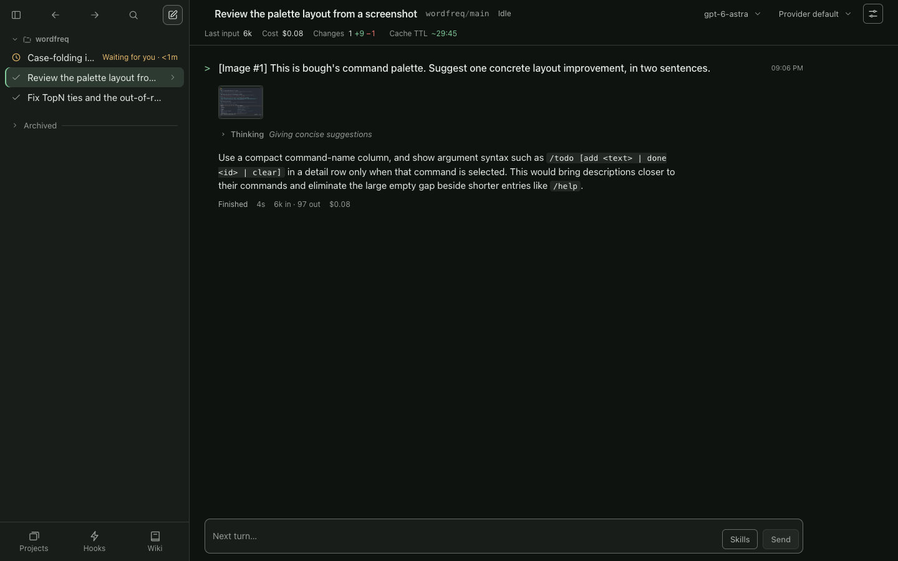

# Screenshots

Everything here is recorded by [scripts/demo](scripts/demo) against the same small repo with two failing tests, using a real model. Re-run the scripts to refresh them.

## Terminal UI

One turn: bough runs the failing tests, reads the code, patches `TopN`, and runs the tests green.

## Web control room (`bough serve`)

A screenshot pasted into the composer goes to the model as an image.

