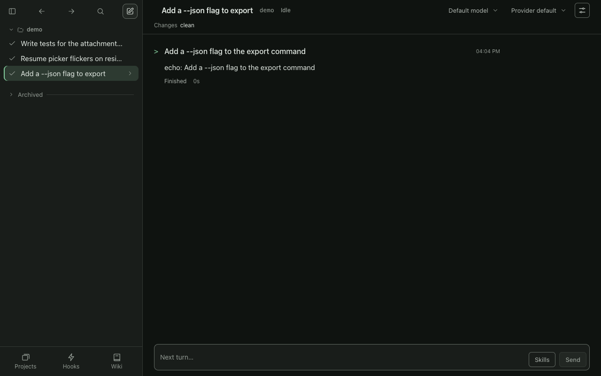

# Screenshots

## Terminal UI

A turn: the model reads, patches and tests a file. Each program collapses to a one-line header.

An expanded program block.

The `/` command palette.

## Web control room (`bough serve`)

Every session in a sidebar, grouped by repo, with the open conversation beside it.

